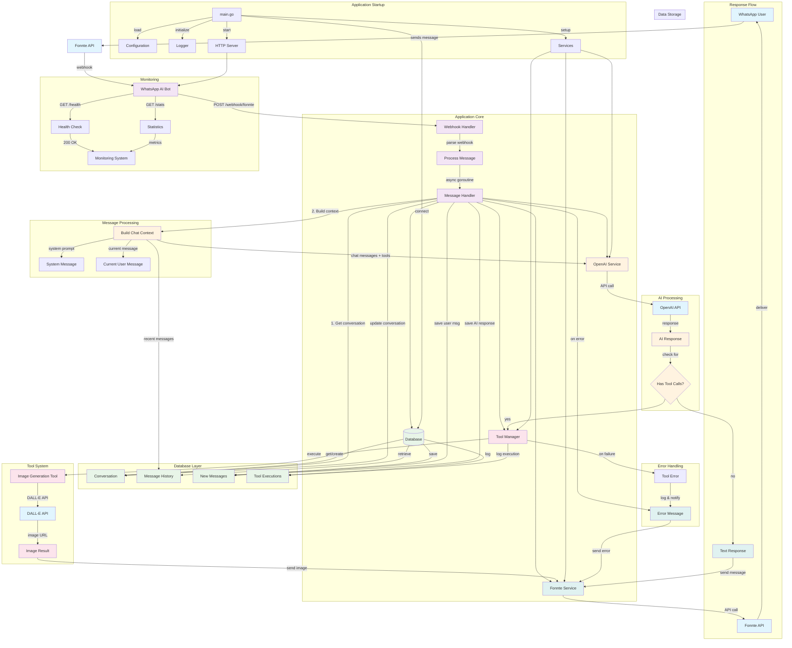

# WhatsApp AI Bot Application Flow

## Application Flow Description

### 1. **Message Reception**
- WhatsApp user sends message through Fonnte API
- Fonnte delivers message via webhook to `/webhook/fonnte`
- Webhook handler parses and validates incoming message

### 2. **Message Processing**
- Message processing runs asynchronously in goroutine
- System retrieves or creates conversation record
- Builds chat context with recent message history
- Adds system prompt and current user message

### 3. **AI Processing**
- Sends chat context to OpenAI with available tools
- OpenAI processes message and determines response
- Checks if response includes tool calls (e.g., image generation)

### 4. **Tool Execution** (if applicable)
- Tool Manager executes requested tools
- Image generation tool calls DALL-E API
- Tool execution results are logged to database
- Generated content is prepared for delivery

### 5. **Response Delivery**
- Text responses sent directly via Fonnte
- Image responses include generated image URL and caption
- All messages delivered back to WhatsApp user

### 6. **Data Persistence**
- User messages saved to database
- AI responses saved to database
- Conversation metadata updated
- Tool execution logs maintained

### 7. **Error Handling**
- Comprehensive error handling at each step
- Error messages sent to user when issues occur
- All errors logged for debugging and monitoring

### 8. **Monitoring & Health**
- Health check endpoint for service monitoring
- Statistics endpoint for performance metrics
- Structured logging throughout application